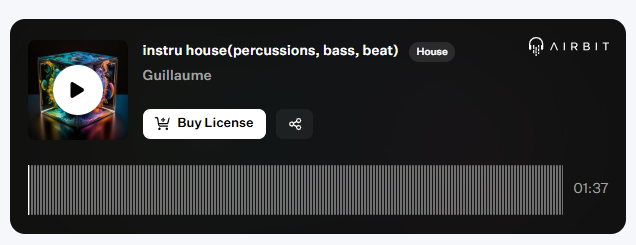

Published on: 17.11.2024

## Description
Entrez dans un univers futuriste avec cette instru Tech captivante, conçue avec Airbit. Les vocaux samplés et modulés apportent une touche mystérieuse et hypnotique, tandis que les FX soigneusement placés ajoutent de la profondeur et de l’atmosphère. Les drums, percutants et précis, tracent un rythme mécanique qui contraste parfaitement avec la rondeur de la basse, profonde et vibrante, pour une expérience sonore immersive.

Cette instru s’adresse autant aux amateurs de beats minimalistes qu’aux créateurs en quête d'une ambiance avant-gardiste et moderne. Une véritable exploration sonore à intégrer dans vos projets les plus audacieux !

## Vidéo YouTube

<iframe width="560" height="315" src="https://www.youtube.com/embed/BRQ5C0iDhEY?si=R8Ig--3U3m9Y71iW" title="YouTube video player" frameborder="0" allow="accelerometer; autoplay; clipboard-write; encrypted-media; gyroscope; picture-in-picture; web-share" referrerpolicy="strict-origin-when-cross-origin" allowfullscreen></iframe>