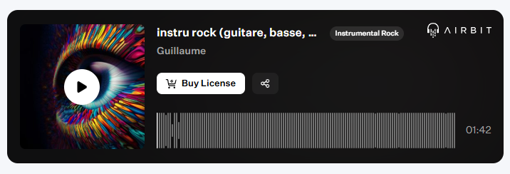

Published on: 04.12.2024

## Description
Découvrez une instru rock puissante et énergique, où la guitare basse joue un rôle central en apportant une base rythmique solide et vibrante. Les riffs percutants, pleins d’attitude, s’entrelacent avec une batterie explosive, dont chaque coup résonne comme un appel à la révolte.

Avec un groove qui pousse à l'action et une dynamique brute et authentique, cette composition est taillée pour des projets remplis de passion et d’intensité. Que ce soit pour une scène dramatique, un clip percutant ou juste pour vibrer au son du rock, "Riff Électrique" est un cri de liberté sonore.

Alors, prêt à monter le volume ? 🎸🥁

## Vidéo YouTube

<iframe width="560" height="315" src="https://www.youtube.com/embed/3OeJMV4GcXQ?si=tHDQZGgrJV1996U-" title="YouTube video player" frameborder="0" allow="accelerometer; autoplay; clipboard-write; encrypted-media; gyroscope; picture-in-picture; web-share" referrerpolicy="strict-origin-when-cross-origin" allowfullscreen></iframe>