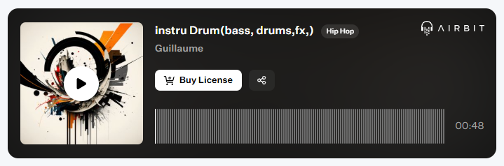

Published on: 04.12.2024

## Description
Préparez-vous à une vague de puissance avec cette instru drum percutante. Les drums, incisifs et percussifs, frappent comme un métronome implacable, donnant le rythme à cette composition minimaliste mais saisissante. La basse, profonde et vibrante, s’impose comme le moteur de l’instru, apportant une énergie brute et hypnotique. Les effets (FX) subtilement intégrés ajoutent une dimension atmosphérique, enveloppant l’ensemble dans une aura futuriste.

"Bass Impact" est taillée pour des projets qui veulent marquer les esprits, idéale pour des sets dynamiques ou des scènes visuelles intenses. Simple mais redoutablement efficace, cette instru frappe là où ça compte.

Prêt à ressentir l’impact ? 🥁🔥

## Vidéo YouTube

<iframe width="560" height="315" src="https://www.youtube.com/embed/VRRhYWN1vhM?si=f9DcMh4X-UEQhdIg" title="YouTube video player" frameborder="0" allow="accelerometer; autoplay; clipboard-write; encrypted-media; gyroscope; picture-in-picture; web-share" referrerpolicy="strict-origin-when-cross-origin" allowfullscreen></iframe>