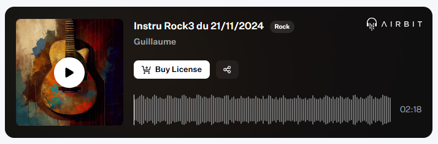

Published on: 04.12.2024

## Description
Laissez-vous emporter par l'énergie brute et authentique de cette instru rock taillée pour les amateurs de sonorités puissantes. La guitare électrique, avec ses riffs incisifs et mélodiques, capte immédiatement l’attention et donne le ton. La basse, groovy et profonde, soutient le morceau avec une intensité vibrante, tandis que la batterie, dynamique et percutante, offre un rythme irrésistible qui propulse l’ensemble.

Parfaite pour des projets pleins de passion, de rébellion ou de liberté, cette composition est un hommage au rock dans toute sa splendeur. Avec "Rock Reverberation", préparez-vous à faire vibrer les murs et les cœurs ! 🎸🥁

## Vidéo YouTube

<iframe width="560" height="315" src="https://www.youtube.com/embed/AExYjC1EdyY?si=lO5XpP1PX7eMRgHa" title="YouTube video player" frameborder="0" allow="accelerometer; autoplay; clipboard-write; encrypted-media; gyroscope; picture-in-picture; web-share" referrerpolicy="strict-origin-when-cross-origin" allowfullscreen></iframe>