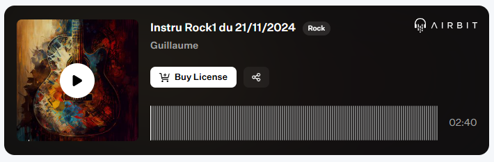

Published on: 04.12.2024

## Description
Découvrez une instru rock énergique qui combine puissance et mélodie. Les riffs de guitare électriques, tantôt rugissants, tantôt mélodiques, captivent dès les premières notes, tandis que la basse profonde et rythmée apporte une fondation solide et vibrante. La batterie, avec ses frappes intenses et dynamiques, donne au morceau une cadence imparable, parfaite pour transmettre l'énergie brute du rock.

"Electric Rush" est conçue pour des projets pleins d'intensité, qu'il s'agisse de scènes d'action, de moments d'émotion forte, ou de performances live. Cette composition incarne l'esprit du rock : passion, liberté et puissance sonore.

Prêt à faire vibrer les amplis ? 🎸🥁🔥

## Vidéo YouTube

<iframe width="560" height="315" src="https://www.youtube.com/embed/Y7G-cgrIYG0?si=RF-1A33oqyUFI4Jy" title="YouTube video player" frameborder="0" allow="accelerometer; autoplay; clipboard-write; encrypted-media; gyroscope; picture-in-picture; web-share" referrerpolicy="strict-origin-when-cross-origin" allowfullscreen></iframe>