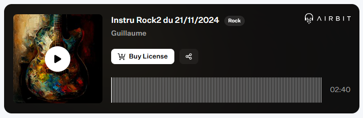

Published on: 04.12.2024

## Description
Entrez dans une ambiance rock plus douce et apaisante avec "Soft Echoes". Les accords chaleureux de la guitare tissent une mélodie réconfortante, empreinte d'émotion et de subtilité. La basse, discrète mais présente, soutient harmonieusement l’ensemble, ajoutant une profondeur subtile qui enveloppe l’auditeur.

Cette composition rock soft est parfaite pour accompagner des moments introspectifs ou des projets empreints de sérénité et de légèreté. Avec son équilibre entre simplicité et émotion, "Soft Echoes" invite à se laisser porter par les vagues sonores.

Prêt à ressentir la douceur du rock ? 🎸✨

## Vidéo YouTube

<iframe width="560" height="315" src="https://www.youtube.com/embed/3zT_f7y4UfE?si=9GM2mh98g2RnL3Yz" title="YouTube video player" frameborder="0" allow="accelerometer; autoplay; clipboard-write; encrypted-media; gyroscope; picture-in-picture; web-share" referrerpolicy="strict-origin-when-cross-origin" allowfullscreen></iframe>